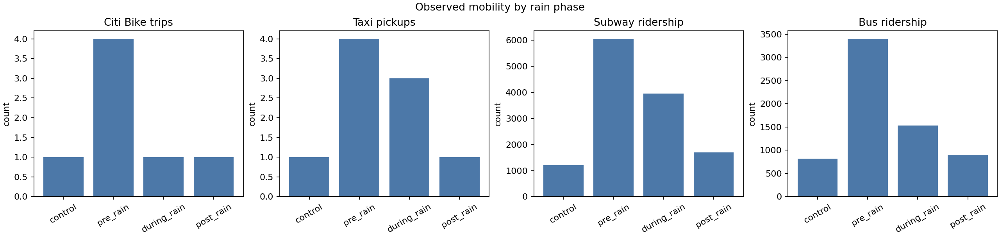
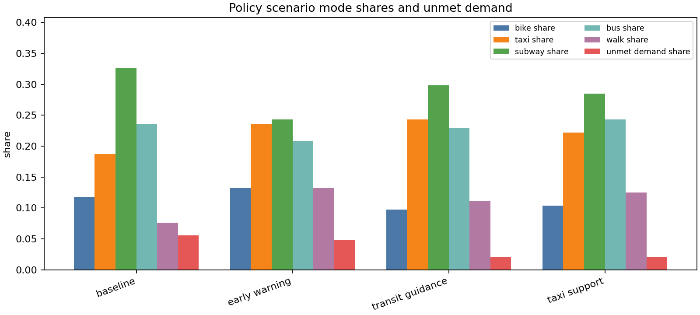
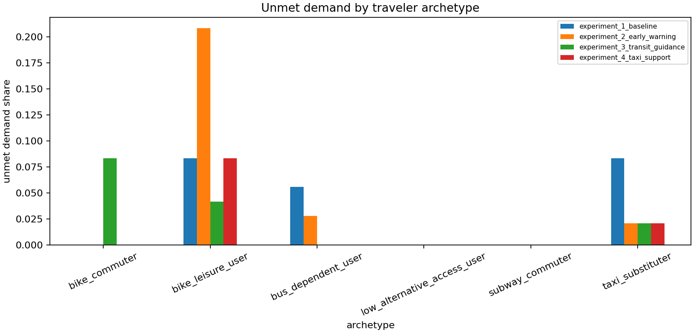

# Rainstorm-Induced Travel Behavior Shifts in New York City

## Executive Summary

This study builds a reproducible AgentSociety2 workspace for testing how rainstorms change urban travel decisions in New York City. The current generated report uses the bundled sample data to prove the pipeline, custom environment, policy simulator, validation checks, and submission packaging end to end. Replacing the sample inputs with public 2024 NYC data refreshes the same tables, charts, agent population, and scenarios.

Key expected contribution: convert observed mobility shifts around storm events into a multi-agent
counterfactual experiment that can compare early warning, transit guidance, and targeted taxi-support policies.

## Research Question

How do New York City travelers change mode choices before, during, and after rainstorms, and which policy interventions reduce trip cancellation, delay, and unequal access to alternatives?

## Scientific Hypotheses

- H1: Rainstorm hours reduce Citi Bike trips, with stronger effects for leisure-like users.
- H2: Suppressed bike demand is only partially substituted by taxi and subway trips; some trips are delayed or cancelled.
- H3: Subway-accessible zones are more likely to shift from bike to subway.
- H4: Taxi-supply-rich zones are more likely to shift from bike to taxi.
- H5: Low-alternative-access zones experience higher cancellation and delay, exposing spatial inequality in transport resilience.
- H6: Early warning, transit guidance, and targeted taxi support reduce disruption through different mechanisms and tradeoffs.

## Data and Pipeline

- City: `New York City`.
- Study months configured: `[6, 7, 8, 9]` in `2024`.
- Mobility data: Citi Bike trips, NYC TLC taxi/FHV trips, and MTA subway hourly ridership.
- Weather data: hourly precipitation from Open-Meteo historical weather.
- Spatial unit: taxi zone by hour; temporal unit: one hour.
- Detected rainstorm events in current run: `1`.

| Dataset | Role in experiment | Public source |
|---|---|---|
| `citibike` | Bike trip response and bike-user archetype calibration | https://citibikenyc.com/system-data |
| `taxi` | Taxi substitution and zone-level taxi supply proxy | https://www.nyc.gov/site/tlc/about/tlc-trip-record-data.page |
| `mta` | Subway substitution and transit-access proxy | https://data.ny.gov/Transportation/MTA-Subway-Hourly-Ridership-2020-2024/wujg-7c2s |
| `weather` | Hourly rainstorm identification and storm phase labels | https://open-meteo.com/en/docs/historical-weather-api |
| `taxi_zones_geojson` | Common spatial unit for mobility aggregation | https://data.cityofnewyork.us/resource/8meu-9t5y.geojson |
| `bike_station_zone_map` | Derived station-to-zone crosswalk for Citi Bike | Derived from public spatial joins or optional local features |
| `mta_station_zone_map` | Derived station-to-zone crosswalk for subway ridership | Derived from public spatial joins or optional local features |
| `acs_zone_features` | Optional socioeconomic and access context | Derived from public spatial joins or optional local features |

## Method

1. Aggregate bike, taxi, subway, and weather data into a `zone_id x hour` panel.
2. Detect rainstorm hours using hourly precipitation thresholds and label pre-rain, during-rain, post-rain, and control windows.
3. Estimate observed mode shifts by comparing storm windows with control hours.
4. Generate traveler archetypes from empirical mode patterns and zone context.
5. Generate AgentSociety2 `init_config.json` and `steps.yaml` files for baseline and policy scenarios.
6. Run a deterministic policy simulator as a fast reproducibility baseline, then use AgentSociety2 for LLM-backed decision experiments when credentials are available.
7. Evaluate mode shares, delay/cancel outcomes, rain exposure, unmet demand, and archetype-level fairness.

## AgentSociety2 Workspace

- Custom environment: `custom/envs/rain_mobility_env.py`.
- Environment tools: `observe_mobility_context`, `get_traveler_profile`, and `record_travel_decision`.
- Generated scenario configs: `nyc_rain_mobility/hypothesis_1/experiment_*/init/`.
- Submission bundle command: `python nyc_rain_mobility/scripts/package_submission.py --zip`.
- Raw public data is excluded from the bundle by default and can be re-downloaded using `download_real_data.py`.

## Reproducibility Status

- Pipeline validation checks: `46/46` passed.
- Errors: `0`.
- Warnings: `0`.
- Validation covers input schemas, generated outputs, AgentSociety2 custom environment metadata, and a runtime environment smoke test.

## Empirical Mobility Shift

| Mode | Control mean per zone-hour | During-rain mean per zone-hour | Percent change |
|---|---:|---:|---:|
| bike | 0.167 | 0.111 | -33.3% |
| taxi | 0.167 | 0.333 | 100.0% |
| subway | 200.000 | 438.889 | 119.4% |

## Policy Simulation

| Scenario | Bike | Taxi | Subway | Delay | Cancel | Unmet demand | Rain exposure |
|---|---:|---:|---:|---:|---:|---:|---:|
| experiment_1_baseline | 21.5% | 22.2% | 48.6% | 5.6% | 2.1% | 7.6% | 2.8% |
| experiment_2_early_warning | 23.6% | 25.7% | 40.3% | 6.9% | 3.5% | 10.4% | 2.8% |
| experiment_3_transit_guidance | 19.4% | 27.8% | 47.2% | 4.9% | 0.7% | 5.6% | 0.7% |
| experiment_4_taxi_support | 18.8% | 27.8% | 46.5% | 6.2% | 0.7% | 6.9% | 0.0% |

- Baseline unmet demand is `7.6%` and direct rain exposure is `2.8%` in the current run.
- Lowest unmet demand scenario: `experiment_3_transit_guidance` with `5.6%` unmet demand.
- Lowest rain exposure scenario: `experiment_4_taxi_support` with `0.0%` rain exposure.
- These sample-run numbers are evidence that the pipeline computes tradeoffs; final policy claims require the full-data run.

## Fairness and Resilience

The fairness view compares unmet demand by traveler archetype. In the full-data run, this should be interpreted together with zone-level subway accessibility, taxi supply, and socioeconomic context.

## Urban Science Significance

The experiment links event-based mobility observation with executable social-science simulation. Instead of only estimating average demand loss, the workflow asks which groups can substitute modes, which zones face higher unmet demand, and how a policy changes system pressure across modes. This makes the model useful for mechanism explanation, scenario reasoning, and transport-resilience policy design.

## Limitations

- The committed outputs are generated from sample data and should not be read as final empirical claims.
- Full-data results should use multiple storm events and external weather-event validation.
- The deterministic simulator is a reproducibility baseline; LLM-backed AgentSociety2 runs require configured API credentials.
- Socioeconomic interpretation should be added after joining richer zone-level features.

## Next Evidence Needed

- Run the same pipeline on one real pilot month, preferably July 2024.
- Compare detected rainstorm events against weather records or local weather reports.
- Recalibrate rain sensitivity and substitution parameters from real empirical shifts.
- Run AgentSociety2 scenarios with LLM-backed PersonAgent decisions after the deterministic baseline is stable.
